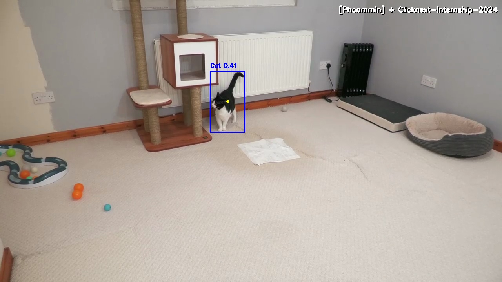

# Cat Detector Project - Internship Exam

โปรเจคนี้จัดทำขึ้นเพื่อทดสอบ Technical Test สำหรับตำแหน่ง AI / Software Internship ของ Clicknext ครับ
(อ้างอิงโจทย์จาก https://github.com/clicknext-ai/internship-2024)

## Objective (เป้าหมาย)
พัฒนาโปรแกรม Python เพื่อตรวจจับและติดตามการเคลื่อนที่ของแมวในวิดีโอ โดยเน้นความถูกต้องของ Logic, การแสดงผลที่ครบถ้วนตามโจทย์, และประสิทธิภาพการทำงานแบบ Real-time ครับ

## Stack & Dependencies
โปรเจคนี้พัฒนาด้วย **Python 3** โดยใช้ Library ดังนี้ครับ:
- **Ultralytics YOLOv8**: ใช้สำหรับ Detection (Model `yolov8n.pt`)
- **OpenCV**: ใช้สำหรับ Image Processing และ Visualization
- **Numpy**: ใช้ช่วยคำนวณทางคณิตศาสตร์เล็กน้อย

## ผลลัพธ์การทำงาน (Result)

> **[กดตรงนี้เพื่อดูคลิปสาธิตการทำงาน (Video Demo)](demo_clip.mp4)**

## What I Accomplished (สิ่งที่ทำไป)
1.  **Bug Fixes**: แก้ไขโค้ดเดิมที่รันไม่ได้ ให้ทำงานได้สมบูรณ์ (แก้ import, โหลดโมเดลผิดชื่อ, loop logic)
2.  **Detection Logic**: 
    - ตั้งค่า YOLO ให้ Filter เฉพาะ Class **"Cat" (ID 15)** เท่านั้น
    - ใช้ Model **Nano** เพื่อให้ FPS สูงที่สุด
3.  **Visualization Features**:
    - วาด Bounding Box สีน้ำเงิน `(255, 0, 0)` ตามโจทย์
    - เพิ่ม **Tracking Line** (เส้นหาง) ลากตามจุดกึ่งกลางของแมว
    - เพิ่ม Text Overlay: `[Phoommin] + Clicknext-Internship-2024` ที่มุมขวาบน
4.  **Optimization**: 
    - ตัดส่วน `VideoWriter` ออกเพื่อลดภาระ I/O
    - ปรับโค้ดให้ Clean และอ่านง่าย

## How to Run (วิธีรัน)
1.  Clone โปรเจคนี้ลงมา
2.  ติดตั้ง Library:
    ```bash
    pip install -r requirements.txt
    ```
3.  **สำคัญ**: ตรวจสอบว่ามีไฟล์วิดีโอ `CatZoomies.mp4` อยู่ในโฟลเดอร์เดียวกัน
4.  รันโปรแกรม:
    ```bash
    python yolo_detector.py
    ```

---
*จัดทำโดย: ภูมินทร์ (Phoommin)*
*Clicknext-Internship-2024 Candidate*
